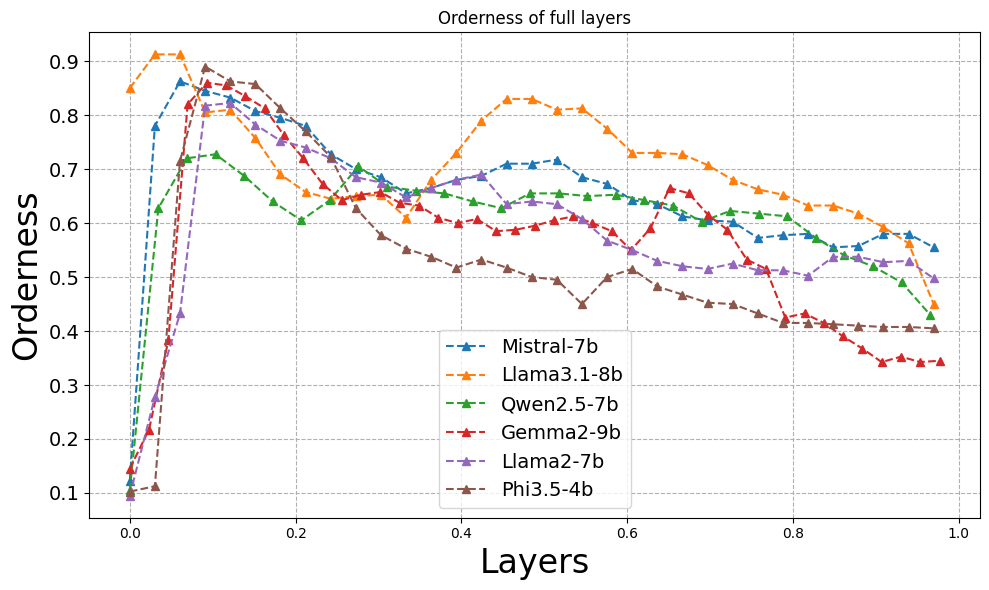

# 🧠 Do Large Language Models Perceive Orderly Number Concepts as Humans?

> 📌 *To appear at the ICLR 2025 Workshop on Representational Alignment (Re-Align)*

This repository contains the codebase and experimental setup for our paper **"Do Large Language Models Perceive Orderly Number Concepts as Humans?"**  

## Overview

Mental Number Line (MNL) is a project aimed at understanding and visualizing the concept of the mental number line, which is a cognitive representation of numbers in a spatial format. This project includes tools for evaluating and analyzing numerical cognition and spatial representation of numbers. We define several metrics to evaluate whether the LLMs exhibit a representation of numbers that mirrors human MNL.


This study sheds light on how LLMs exhibit human-like numerical cognition, such as orderliness in
their number mental number line representations while offering the interpretability of their internalized
numerical processing. To sum up, our key contributions are as follows:
-  Evaluation of orderliness in LLMs: We introduce the orderliness metric to quantify the
spatial arrangement of numerical embeddings, providing a novel approach to studying
numerical cognition in LLMs.
-  Discovery of the Double Descent Pattern: We identify a double descent trend in the order-
liness metric across layers in six mainstream LLMs, revealing hierarchical refinement of
numerical representations.
-  Advancements in Interpretability: Our findings contribute to the understanding of how
LLMs internalize structured numerical representations.

## Generate embeddings and compute metrics

To generate embeddings and compute metrics, update the models and other settings in the eval.sh. And run

```bash
sh eval.sh
```
